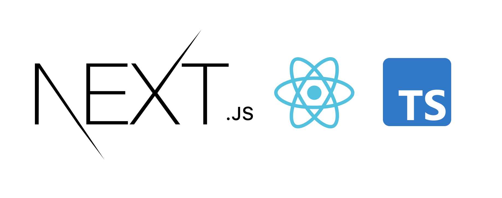
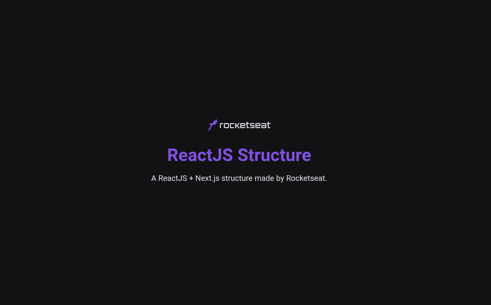

<br>
<div align="center">
  

  <h4 align="center">
     Next.js, Typescript, Prettier, Eslint, EditorConfig, Jest, Styled-components
  </h4>
</div>

---

<p align="center">
  
</p>


## 🚀 Getting started

To clone and run the application, you will need to have [Git](https://git-scm.com), [Node.js](https://nodejs.org) + [Yarn](https://yarnpkg.com) installed on your machine. With all programs installed, run the following command lines:


```bash
# Create new project

$ degit https://github.com/YagoLopes/template-nextjs-typescript [NOME_DO_PROJETO]

```
